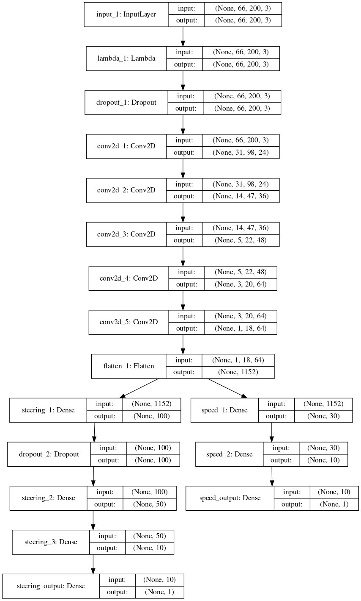
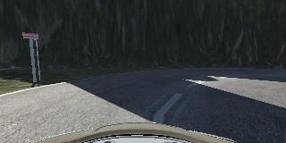
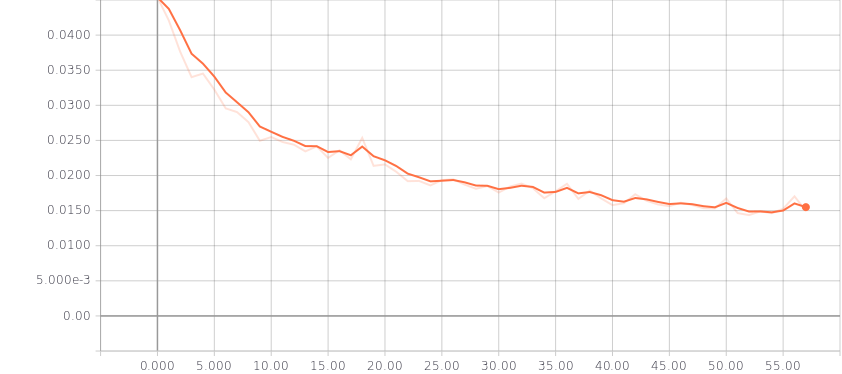
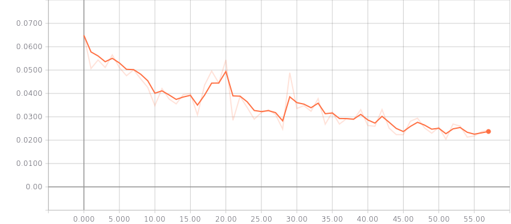

# Behavioral Cloning Project

The goals / steps of this project are the following:
* Use the simulator to collect data of good driving behavior
* Build, a convolution neural network in Keras that predicts steering angles from images
* Train and validate the model with a training and validation set
* Test that the model successfully drives around track one without leaving the road
* Summarize the results with a written report

## Rubric Points

### 1. Submission includes all required files and can be used to run the simulator in autonomous mode

My project includes the following files:
* model.py containing the script to create and train the model
* drive.py for driving the car in autonomous mode
* model.h5 containing a trained convolution neural network
* writeup_report.md summarizing the results
* lake-race.mp4 showing performance on the first track
* jungle.mp4 showing performance on the jungle track (graphics set to fantastic)
* jungle-fastest-quality.mp4 showing performance on the jungle track (graphics set to fastest)

### 2. Submission includes functional code
Using the Udacity provided simulator and my drive.py file, the car can be driven autonomously around the track by executing 
```sh
python drive.py model.h5
```

### 3. Submission code is usable and readable

The model.py file contains all the code rencerning the model and preprocessing. I used tensorflow-1.2 and keras-2.0.

## Model Architecture

### Architecture
My model is a slight vairation of the NVIDIA model. It is defineed in `build_model` (model.py:167).
Like in the NVIDIA paper I use YUV images as input. To fit the input size of the NVIDIA model, the input images are cropped.
To normalize the input I use a Lambda layer.

To combat overfitting I introduced 2 dropout layers.
I also decided to include an output for speed with it's own set of fully connected layers.


### Training

#### Collected data
I had to collect data multiple times.
The first time I had 115217 samples in total.
They were rougly evenly distributed between track 1 and track 2.
That time I used the keyboard exclusively.
I was able to get it to work, but not very smoothly.

The second time I collected 7827 samples just from track 1.
This time I used the mouse for steering input.
I was able to get thhe model working on this fairly well, but It lacked the samples for track 2 to run that track successfully.

The third time I collected 34946 samples of which about 2/3 were driving on track 1.
Again I used the mouse for steering.
I also included some `recovery` samples for track 1, but found them to help little in performance.
For track 2 however, they helped a lot. Here is an example of where they helped:


#### Data Augmentation
To increase data variety and reduce bias, I used a generator to introduce new samples.
To get the final training sample I do the following transformations (model.py:87):
1. Choose one of the 3 images (left, center, right) and record difference in steering angle
2. Randomly translate the image and record difference in steering_angle
3. Randomly flip the image and invert the image vertically
4. Calculating new steering angle using the calculated differences. I used a non-linear function to do this: $(diff+diff^3)*0.1$.
5. Adjust the speed so that the car goes slower when it gets off track.

#### Training method
I used an epoch size of 40000 and a batch size of 100.

I trained both outputs simultanously, but giving the steering preference.
I did this by setting the `loss_weights` to 1 and 0.1 for steeringg and speed respectively. (model.py:219)

I used the Adam optimizer, so I didn't have to tweak the learning rate.

To speed up training time, I was using a threadsafe generator along with Keras's `fit_generator` method.
This way I was able to get through 1 Epoch in 30s.


## Evaluation

### Model architecture
I decided to start off with the NVIDIA model.
In the first iteration I extended this network to accept the images as they come in (320x160).
While doing so, I also introduced another fully connected layer.
With this initial network and without the `translation` during augmentation I was able to finish both laps successfully.
While it worked, it was not driving very smoothly.
Here, I think the first training set was partly to blame, but the model was quite happy to overfit on the data and I needed more training data than I was happy with.

When developing the first iteration of the architecture, I was unhappy that I had to manually tweak the speed in `drive.py`.
To do away with this, I included another output for speed.
That way I was able to go around track 1 full speed, while simultanously going slow at the challenging parts of track 2.

Since this model required a lot of training data, I then decided to go back to the original model and only tweak it slightly.
To fit the input data for the model, I cropped the images to 200x66.
Doing this also enabled me to use augmentation via translation.
This would have been difficult for the full size images as it is unclear what the new area should display.
One could use a generative model here, but I didn't explore that option.
I also included 2 dropout layers to reduce overfitting.
With this I was able to train the model on only 7827 samples to go around track 1.
This was also the architecture I used for the submitted model.

### Model selection
I found that validation loss was not a good measure of model performance.
While all models after a certain epoch (usually <= 15) were able to drive around track 1,
they started to oscillate around the lane center.
When you look at the curve for validation loss, you can actuelly tell when ecactly this happens:

At epoch 17 the car drives very smoothly.
After that the validation loss goes up for 1 iteration and from then on the model performs poorly.

With the `speed_output`, the trend is much less clear. This is expected as I assigned it a very low weight.


### Possible areas of improvement
The model as it is now performs fairly well on little data.
One could, however tweak the augmentation more, such that it generalises better.
Possible further augmentations:
* include shadows
* shift colors
* rotations

I tested my model against the mountain track of the old simulator and it got totally confused by the different color pallette.
Some of the above would much likely help improving performance there.
One could also experiment with other colorspaces as input for the model.

Another possibility would be to also include previous images in the input.
This could then be processed using 3D convolutions until the time dimension was reduced to 1.
Doing this, the model could learn to guage distances better.

One could also use an RNN.
The model could then explicitly learn not to oscillate.
I didn't explore this option because it requires a lot more training data than the simple models.

If I had all the images for driving as well as for training, I would have tried to extract a depthmap using opencv's `createStereoBM`.
I did try to use this function on consecutive images, but got mixed results from that.
