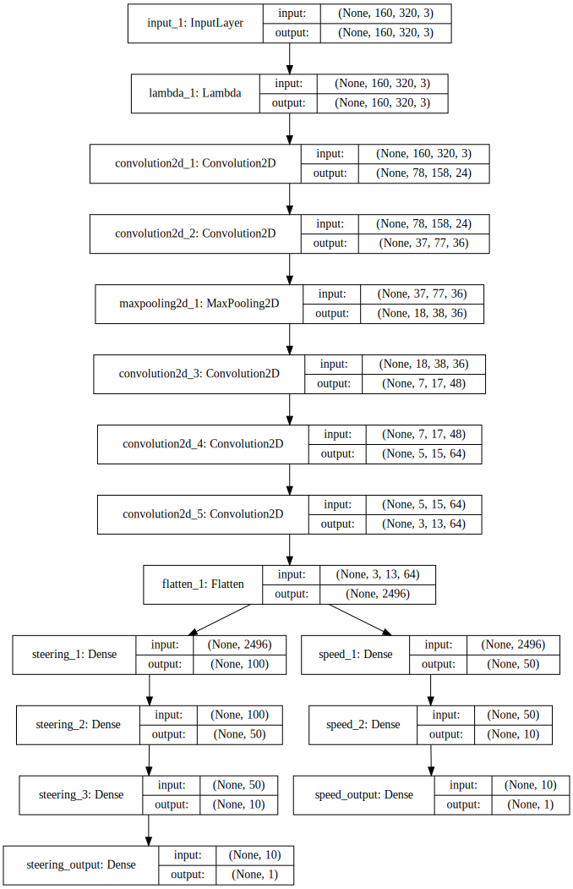

# Behavioral Cloning Project

The goals / steps of this project are the following:
* Use the simulator to collect data of good driving behavior
* Build, a convolution neural network in Keras that predicts steering angles from images
* Train and validate the model with a training and validation set
* Test that the model successfully drives around track one without leaving the road
* Summarize the results with a written report

## Rubric Points

### 1. Submission includes all required files and can be used to run the simulator in autonomous mode

My project includes the following files:
* model.py containing the script to create and train the model
* drive.py for driving the car in autonomous mode
* model.h5 containing a trained convolution neural network
* writeup_report.md summarizing the results
* lake-race.mp4 showing performance on the first track
* jungle.mp4 showing performance on the jungle track (graphics set to fantastic)
* jungle-fastest-quality.mp4 showing performance on the jungle track (graphics set to fastest)

### 2. Submission includes functional code
Using the Udacity provided simulator and my drive.py file, the car can be driven autonomously around the track by executing 
```sh
python drive.py model.h5
```

### 3. Submission code is usable and readable

The model.py file contains all the code rencerning the model and preprocessing. I used tensorflow-1.2 and keras-2.0.

## Model Architecture

### Architecture
My model is a slight vairation of the NVIDIA model. It is defineed in `build_model` (model.py:167).
Like in the NVIDIA paper I use YUV images as input. To fit the input size of the NVIDIA model, the input images are cropped.
To normalize the input I use a Lambda layer.

To combat overfitting I introduced 2 dropout layers.
I also decided to include an output for speed with it's own set of fully connected layers.


### Training

#### Collected data
I collected driving samples for both track 1 and track 2.
The final had 34946 samples of which about 2/3 were driving on track 1.
I did also include some "recoveries", where the car ended up too far away from the center.

#### Data Augmentation
To increase data variety and reduce bias, I used a generator to introduce new samples.
To get the final training sample I do the following transformations (model.py:87):
1. Choose one of the 3 images (left, center, right) and record difference in steering angle
2. Randomly translate the image and record difference in steering_angle
3. Randomly flip the image and invert the image vertically
4. Calculating new steering angle using the calculated differences. I used a non-linear function to do this: $(diff+diff^3)*0.1$.
5. Adjust the speed so that the car goes slower when it gets off track.

#### Training method
I used an epoch size of 40000 and a batch size of 100.

I trained both outputs simultanously, but giving the steering preference.
I did this by setting the `loss_weights` to 1 and 0.1 for steeringg and speed respectively. (model.py:219)

I used the Adam optimizer, so I didn't have to tweak the learning rate.

## Evaluation

TODO
